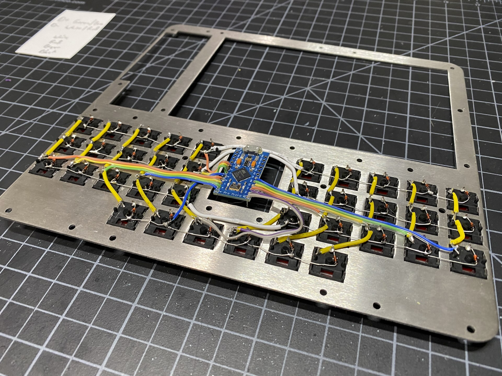

# The PiMech Deck - Keyboard

The keyboard for the PiMech is handwired using low profile Kailh Choc switches.  I choose these as they are 
readily available, have a pretty nice feel and can keep the whole build small.  If you use my plate, these 
are spaced slightly differntly than normal MX switches and will only fit specific "Choc Spacing" cap.  I 
REALLY recommend the MBK profile caps for these.

The keyswitches snap into the plate, but you'll need to wire them all up to each other to form a matrix and then
wire them to a microcontroller.  The Arduino Pro-Micro is the go-to for this and there are many genuine, clones and 
remixes available.  

For details of how to handwire a board, check this [Handwiring Guide](https://geekhack.org/index.php?topic=87689.0)

Here's one more photo to show how I ended up wiring this up and where the MCU sits. There is a cutout in the 
plate to provide access once the whole thing is assembled. It's covered by a specific case piece that can be
easily removed if you need to get in to flash it or otherwise modify things.

# Click below for more.....
* [Home](../README.md)
* [Build Hints](../docs/overview.md)
* [Keyboard Details](../docs/keyboard.md)
* [Parts list (BOM)](../docs/bom.md)
