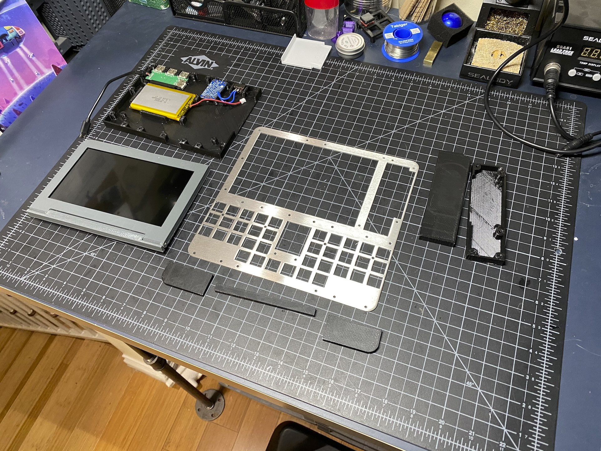
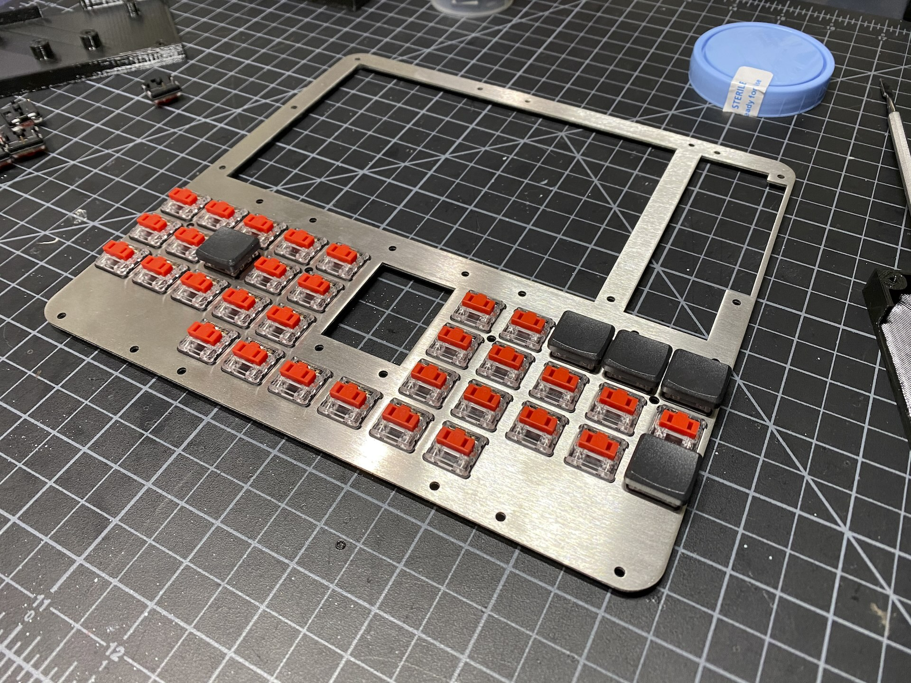
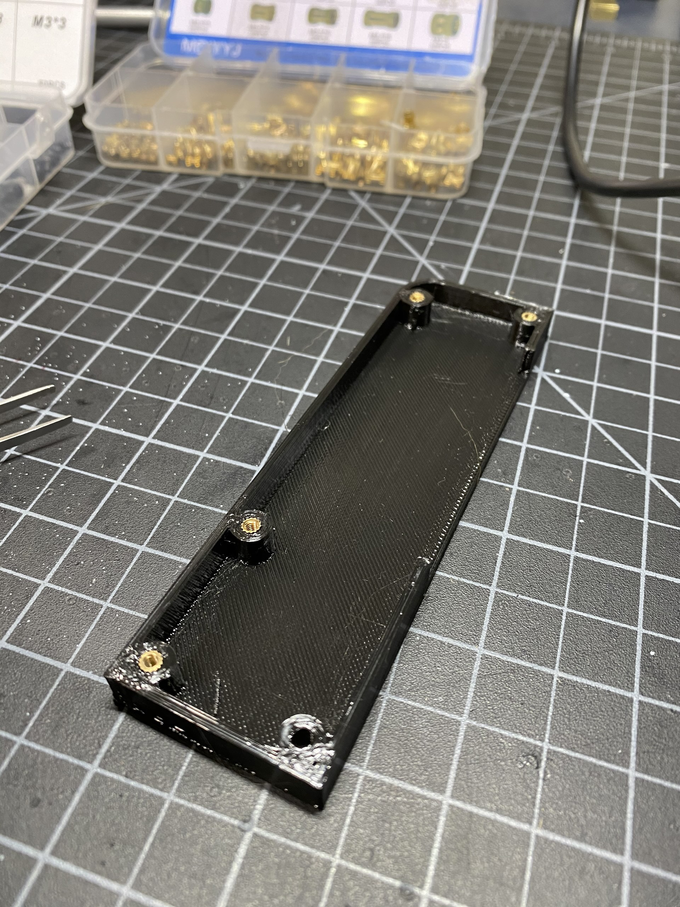
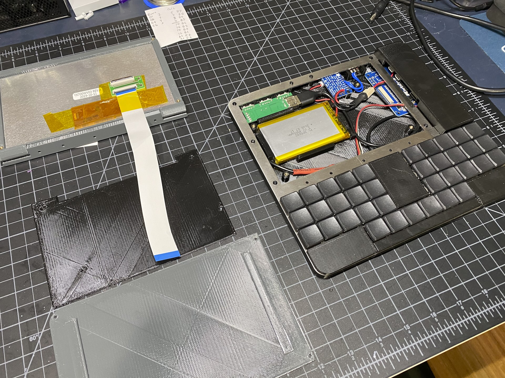
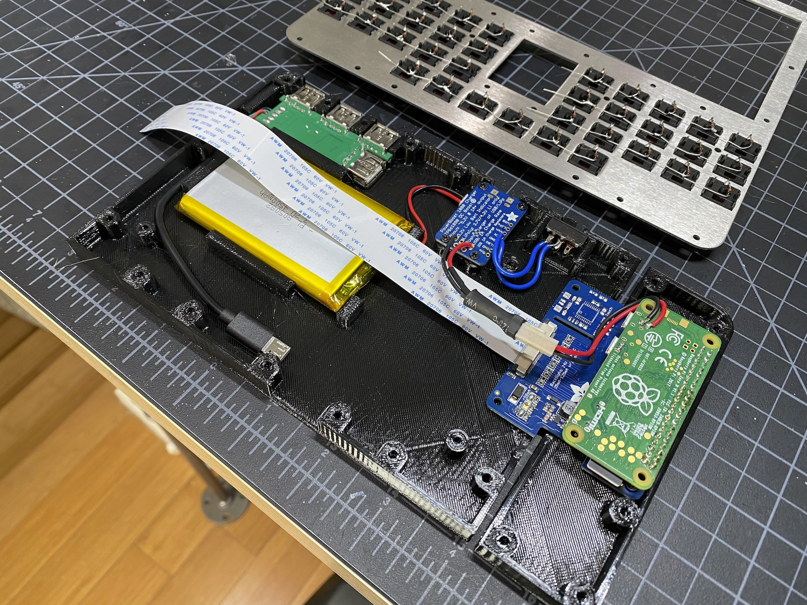

# The PiMech Deck - Build Overview / Hints

Pictured above is the earliest photo I took as I was test fitting the pieces.  The 
general build order is:

* Get the metal plate cut
* Handwire the keyboard and test it
* Meanwhile, print all the printed bits
* Insert the inserts into the printed parts
* Fit the screen and assemble the screen housing
* Fit the battery, charging circut and USB hub into the tub
* Fit the Kippah and pi together into the right smaller tub
* Wire everything together
* Bolt all the bits to the plate
* Attach the screen
* Attach the cover over the electronics

There's a lot there to do, but nothing particuarly difficult.  Reach out with questions.  Here's one KEY point
before I dive into more photos...

## Check your battery JST polarity!
Check that business!  Different batteries/charging boards have different JST pinouts.  
Make sure you check your combination and adjust the plug as needed.

Okay... with that done.....

## Get the metal plate cut

You can see the plate alone in the photo above. You can choose any material, but I went with
stainless steel as it's cheap and strong.  To have the switches properly latch into place you'll 
need to have a thickness around 1.2mm. Too much thicker and the switches won't seat correctly and 
the plate is the only thing holding them in place.

I use SendCutSend here in the US, and I've heard good things about LaserBoost in Europe.  The file
is ready to go under /case/plate_v01.dxf.  Scale is in MM if your service asks you to verify.

## Handwire the keyboard and test it

## Meanwhile, print all the printed bits

## Insert the inserts into the printed parts

## Fit the screen and assemble the screen housing

## Fit the battery, charging circut and USB hub into the tub

## Fit the Kippah and pi together into the right smaller tub

## Wire everything together

## Bolt all the bits to the plate

## Attach the screen

## Attach the cover over the electronics

# Click below for more.....
* [Home](../README.md)
* [Build Hints](../docs/overview.md)
* [Keyboard Details](../docs/keyboard.md)
* [Parts list (BOM)](../docs/bom.md)
