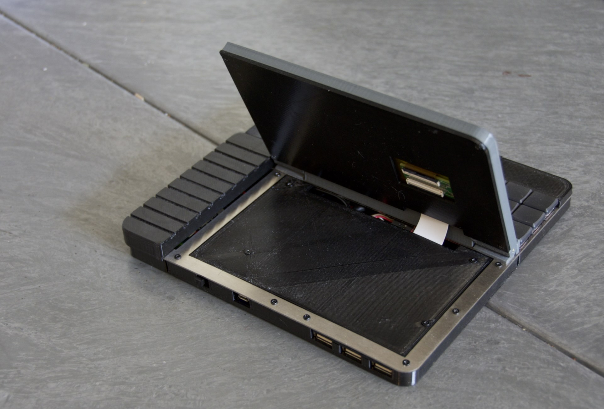

# The PiMech Deck - Build Overview / Hints

Pictured above is the earliest photo I took as I was test fitting the pieces.  The 
general build order is:

* Get the metal plate cut
* Handwire the keyboard and test it
* Meanwhile, print all the printed bits
* Insert the inserts into the printed parts
* Fit the screen and assemble the screen housing
* Fit the battery, charging circut and USB hub into the tub
* Fit the Kippah and pi together into the right smaller tub
* Wire everything together
* Bolt all the bits to the plate
* Attach the screen
* Attach the cover over the electronics

There's a lot there to do, but nothing particuarly difficult.  Reach out with questions.  Here's one KEY point
before I dive into more photos...

## Check your battery JST polarity!
Check that business!  Different batteries/charging boards have different JST pinouts.  
Make sure you check your combination and adjust the plug as needed.

Okay... with that done.....

## Get the metal plate cut

You can see the plate alone in the photo above. You can choose any material, but I went with
stainless steel as it's cheap and strong.  To have the switches properly latch into place you'll 
need to have a thickness around 1.2mm. Too much thicker and the switches won't seat correctly and 
the plate is the only thing holding them in place.

I use SendCutSend here in the US, and I've heard good things about LaserBoost in Europe.  The file
is ready to go under /case/plate_v01.dxf.  Scale is in MM if your service asks you to verify.

## Handwire the keyboard and test it

There is a whole page on the details of this.  Check the navigation below.  Key thing is to do this 
before you start bolting anything else to the case to make things as easy as possible.

## Meanwhile, print all the printed bits

All the STL files you'll need are in the /case subdir.  You'll need one of everything.  Tubs are the 
bottom pieces and bezels are the top.  The screen has it's own files `screen_tray_*` with a bottom 
and top piece.  

The USB retainer can be used if you like to shim a small area between the metal plate and the external
USB ports. It's not required and can be a bit of tight fit, depending on your printer.

## Insert the inserts into the printed parts

All the screws mate into threaded brass inserts.  I set my soldering iron to 250c, which is just above 
the melting point of my filament, and use an old tip which fits inside the insert.  This allows me to 
heat the insert and use the iron to push them in.  I usually end up needing a set of tweezers to hold 
the insert in while I remove the iron.

Most of the inserts are for securing case pieces, and these use M2.5 inserts and screws.  There are 
some for the lipo charger and kippah, thes should be M2.  

Use the longest inserts you can.  All the blind holes (no exit) for the structure/case need inserts. 
Some screws go from the top through the plate and into the inserts (screen area and around the keys of 
the keyboard. The remaining ones are screwed in from the bottom through the tub pieces, the metal plate
and up into the bezel pieces to sandwich everything together.  

## Fit the screen and assemble the screen housing

This is the only photo I took that shows the screen sitting in the top of the tray.  It friction fits in
and should hold snug.  Make sure you remove the protective coating before you insert it and screw the tray
together.  I used kapton tape to tidy up the cable extension PCB and secure it to the back of the screen.  
The version of the screen tray back pictured here is missing a cutout for the extender PCB which I added 
later to make the whole thing fit easier.

The extension cable will need to be mated to the PCB and routed 
inside the screen tray and out the bottom.  Here's the best photo I have which shows the routing:

## Fit the battery, charging circut and USB hub into the tub

The battery and USB hub are friction fit, as is the switch for the charging board.  The board itself
screws into M2 inserts.  In the photo above I still have the normal mini-USB plug on the cable for 
the hub, but I cut this and extended it so it can reach the port on the Pi.

The output of the charger needs to be wired up to the pi, you can either fit a mini-usb plug to it
or just solder onto the pads under the board as in the photo above.

## Fit the Kippah and pi together into the right smaller tub

Refer to the photo above.  The Kippah is secured with two screws and the Pi just plugs in to it and 
is not secured in any other way.  

## Wire everything together

Check the assembly photo above to see my final wiring.  This has the USB hub cable extended, the
power routed to the Pi and the keyboard controller plugged into the internal port of the USB hub.
There is a good amount of room, so you should not have to be toooo fussy.

## Bolt all the bits to the plate

Some of the 3d printed tub pieces are secured to the plate with screws from the top.  The remainder are 
screwed through the bottom tub pieces and the plate into the bezel pieces. Hopefully from the placement of
stand-offs, plate holes and pieces this will be clearer.  Feel free to ask any questions along the way.

## Attach the screen

Once all the body pieces are secured, the last big task is to secure the hinge to the screen tray and then
screw through the big tub below the screen into hinge.  I used solid brass 2.4mm diameter rod as a hinge pin.
I suggest using two pins, one for each side, but you could go stright through with one long piece if you like.

Once you've got the screen tray attached to the hinge, you can secure the assembly to the unit with screws through
the tub underneath.  Use the longest screws/inserts you can here as this takes a bit of force.

Depending on your printer tolerances, etc the screen may or may not hold position when open.  You can adjust this a bit 
with printer settings, or print the `Friction_wedge_v3.stl` and insert these from the sides to add more friction.  This
is one of the trickier bits and there is not substitute for experimentation here.

## Attach the cover over the electronics

There is thin cover that secures directly to some standoffs in the screen tub piece.  Secure it with short screws to 
keep everything tidy and protected.  Then, you are done!

Install any OS you like, but Raspian is well supported by Adafruit with the Kippah driver, so I'd suggest sticking with
that unless you are daring.

## Thanks!

Thanks for reading this guide and maybe trying to build one of these.  Reach out if you do, I'd love to see what you built
and learn from your experiences.

# Click below for more.....
* [Home](../README.md)
* [Build Hints](../docs/overview.md)
* [Keyboard Details](../docs/keyboard.md)
* [Parts list (BOM)](../docs/bom.md)
